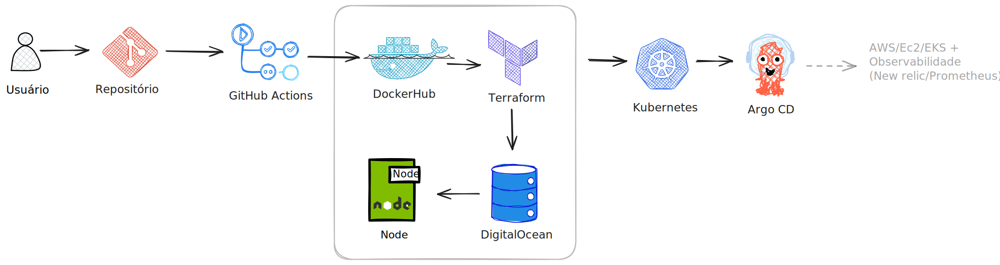
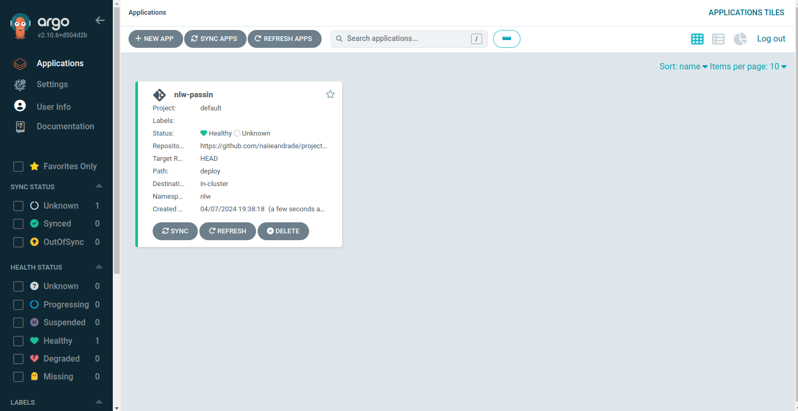
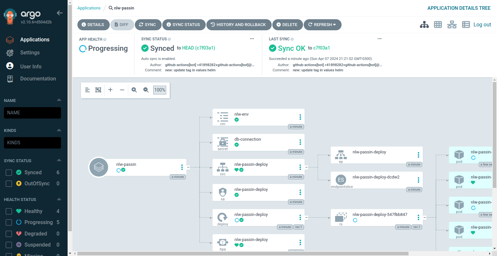
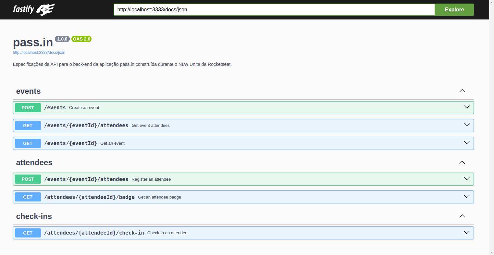

## Sobre

Esse projeto faz parte da trilha de Devops da NLW Unite, ministrada por Daniel Rodrigues da Silva.

O objetivo desse projeto é aplicar as práticas de devops. A aplicação já em node já foi disponibilizada. Foram utilizados os serviços de docker para subir a aplicação, docker-compose para subir o banco e conectar à aplicação; o workflow do github actions para criar uma integração contínua automatizando o passo a passo do build da imagem e subindo e atualizando ela no Docker Hub; como serviço de IaC (Infrastructure as Code) foi utilizado o terraform para criar um cluster e um banco de dados na DigitalOcean; e o Argo CD que é uma ferramenta de entrega contínua declarativa criada especificamente para Kubernetes/k3d. É possível ter uma visão geral do projeto na imagem abaixo:




## TODO

Ainda existem alguns desafios para esse repositório que incluem:

- [ ] Para o migrations funcionar é preciso acessar o container da API e rodar `npm run db:migrate`. Ver como arrumar isso e fazer com que suba direto já com as migrations.
- [ ] Templetizar os arquivos secret e configmap em `nlw.service.passin/deploy/templates`.
- [ ] Como rodar na AWS; se usando EC2 e/ou EKS.
- [ ] Melhorar o README e deixar o passo-a-passo ou comandos para que seja possível rodar o projeto atual.


## Passo-a-passo para rodar o projeto [a melhorar]
### Argocd

```
sudo kubectl port-forward svc/argocd-server -n argocd 3001:80
```
rodando no localhost:3001

```
sudo kubectl -n argocd get secret argocd-initial-admin-secret -o jsonpath="{.data.password}" | base64 -d
```




Dentro da pasta de deploy.cross 
```
sudo kubectl apply -n argocd -f apps/passin
```

Nesse comando aqui acima eu precisei apagar e subir o comando de novo até ele pegar o path correto e sincronizar corretamente como na imagem abaixo:


para ver o deploy rodando:
```
kubectl get pods -n nlw
```
para ver onde está rodando/nome da aplicação
```
sudo kubectl get svc -n nlw
```

e depois o port forward para..?

```
sudo kubectl port-forward svc/nlw-passin-deploy -n nlw 3333:80
```

e em localhost:3333/docs, vai estar rodando a app:




### AWS

criar cluster kubernates 
`aws eks --region us-east-2 update-kubeconfig --name nlw-k8s`

`kubectl get pods -n kube-system`

instalar o argo na aws...

`kubectl create namespace argocd`

`kubectl apply -n argocd -f h...`

entrar na pasta nlw.deploy.cross (no kubernates na aws)
e rodar a aplicação e o repo
`kubeclt apply -n argocd -f apps/passin`

É um clusterIp 
`kubeclt get svc -n argocd` 

`kubectl port-forward svc/argocd-server -n argocd 3001:80`

